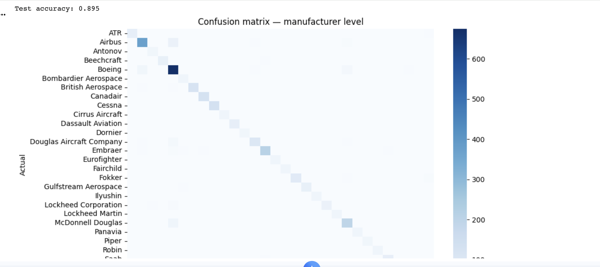

# Aircraft Manufacturer Classifier

A computer vision model that looks at a photo of an airplane and identifies its manufacturer (Boeing, Airbus, Cessna, and 27 others). Built to learn how image classification models are actually trained, tested, and improved, not just how to call a pre-built API.

**Final result: 89.5% test accuracy across 30 manufacturer classes.**

## The idea

I'm an aviation enthusiast, and after taking a Modern Analytics course at Duke covering PyTorch and computer vision fundamentals (with a class project on dogs vs. cats), I wanted to push the same techniques on something harder and more personally interesting: telling aircraft manufacturers apart from a photo.

This turned out to be a much harder problem than it sounds. Aircraft from different manufacturers can look remarkably similar from certain angles. Sometimes the difference comes down to subtle details like engine shape or window spacing, not obvious features like you'd see comparing a dog to a cat.

## How it works

The model uses transfer learning: starting from a ResNet (a convolutional neural network pretrained on 1.2 million general images), then fine-tuning it specifically on aircraft photos from the [FGVC-Aircraft dataset](https://www.robots.ox.ac.uk/~vgg/data/fgvc-aircraft/), a benchmark dataset of 10,000 labeled aircraft images built for exactly this kind of fine-grained classification problem.

## The process: what actually worked, and what didn't

I tried several approaches in sequence, working through each one with Claude (Anthropic's AI assistant) as a coding and debugging partner, used to explain concepts, diagnose training runs, and reason through why certain changes did or didn't help. I treated the approaches that failed as real findings, not wasted effort.

**1. Frozen backbone (baseline).** Only training a new final layer on top of a frozen, pretrained network. This is the fast, common approach to transfer learning, and it plateaued at **44.6% validation accuracy**. Not good enough. The frozen network could only reuse generic visual features, not features specific to telling aircraft apart.

**2. Unfreezing the full network.** Allowing every layer to adjust during training, not just the last one. This let the model learn aircraft specific visual patterns instead of generic ones, and immediately jumped accuracy to **83.2%**.

**3. Regularization (dropout, weight decay, stronger augmentation).** Added to address mild overfitting, where the model performed much better on training images than on new ones. This is a standard fix, but in this case it didn't help. Final accuracy actually came in slightly lower. The real limiting factor turned out to be dataset size, not lack of regularization.

**4. A larger model (ResNet50) with checkpointing.** Switching to a bigger network gave it more capacity to learn subtle distinguishing details, and saving the best performing version during training, rather than just whatever the final epoch produced, protected against overfitting late in the run. This combination produced the final result: **90.2% validation accuracy, 89.5% on the held out test set.**

## Where it still struggles

The confusion matrix below shows a strong diagonal, meaning the model is right the vast majority of the time. The errors that remain cluster around visually similar aircraft, particularly certain Boeing and Airbus models seen from angles that don't clearly show distinguishing features like engine shape. That's a natural next direction: training at a more specific level, by aircraft family or exact model rather than just manufacturer, to see how the model handles an even harder version of the same problem.

## Tools used

Python, PyTorch, and torchvision, trained on Google Colab with a GPU runtime. Claude (Anthropic) was used throughout as an AI coding assistant for debugging, concept explanations, and iterating on the modeling approach.

## What's next

- Train at the aircraft family level (e.g. "Boeing 737" rather than just "Boeing") for a genuinely harder version of this problem
- Use Grad-CAM to visualize which parts of an image the model relies on to make its decisions
- Wrap the trained model in a simple app so a photo can be classified directly from a phone
